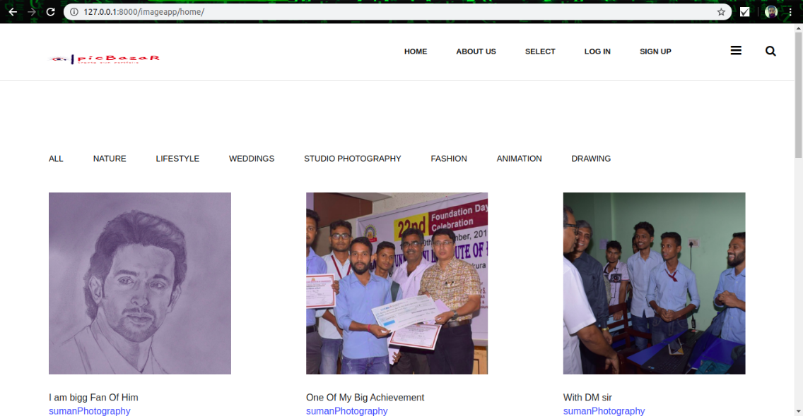
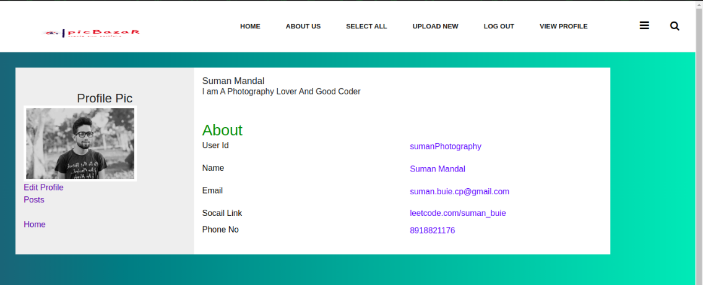
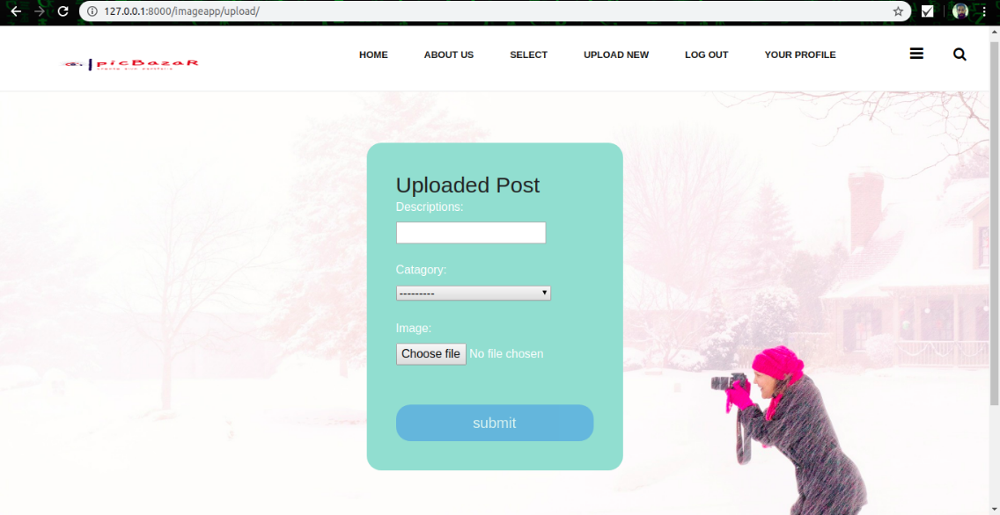
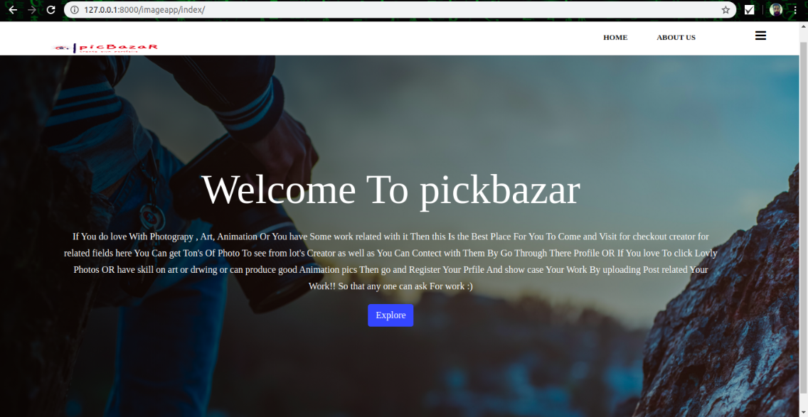
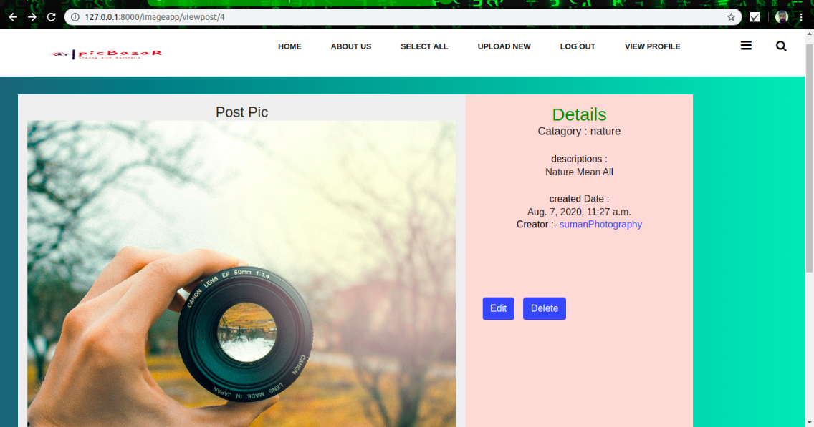

# piKbazar

This project was done by me for helping Out Those people Who love Photograph, Animation and Drawing . 
<h3>Project Live at</h3> : http://pibazar.pythonanywhere.com/

<h2>Assignment Problem Statement:</h2>

<h4>Part 1:</h4>
<ol>
    <li>Create a web-app where a user can login.</li>
    <li>User can upload Photos.</li>
    <li>User can view his/her Photos.</li>
</ol>

<h4>Part 2:</h4>
<ol>
     <li>User can search and view profile of other users.</li>
     <li>They can share their uploaded Photos with any of those users.</li>
     <li>Users can see the shared files by other users also in uploaded files.</li>
</ol>

<h4>Additional Features:</h4>
<ol>
    <li>In users profile user can set his/her profile picture.</li>
    <li>Users can download other users uploaded Pics.</li>
    <li>The user can upload any type of files such as image </li>
</ol>
    
<h2>Technologies Used:</h2>
<ul>
    <li>Python</li>
    <li>Django</li>
    <li>Bootstrap</li>
    <li>JavaScript</li>
</ul>
    
  
<h2>Note :</h2>

<b>The Secret_Key required for the execution and debugging of project is not removed from the project code. So you can use the project as your college mini-project or by using the project code you can build your own project.</b>

<h2>Usage :</h2>

    python django_web_app/manage.py makemigrations

    python django_web_app/manage.py migrate

    python django_web_app/manage.py runserver
    
   In your web browser enter the address : http://localhost:8000 or http://127.0.0.1:8000/

# Screenshots : 

# Support :
If you found this project helpful or you learned something from the source code and want to thank me, consider me to pay my internet bills. This would encourage me to create many such projects 👨🏻‍💻
<ul>
    <li><b>G Pay :</b> +918918821176</li>
    <li><b>PhonePe :</b> +918918821176</li>
</ul>
